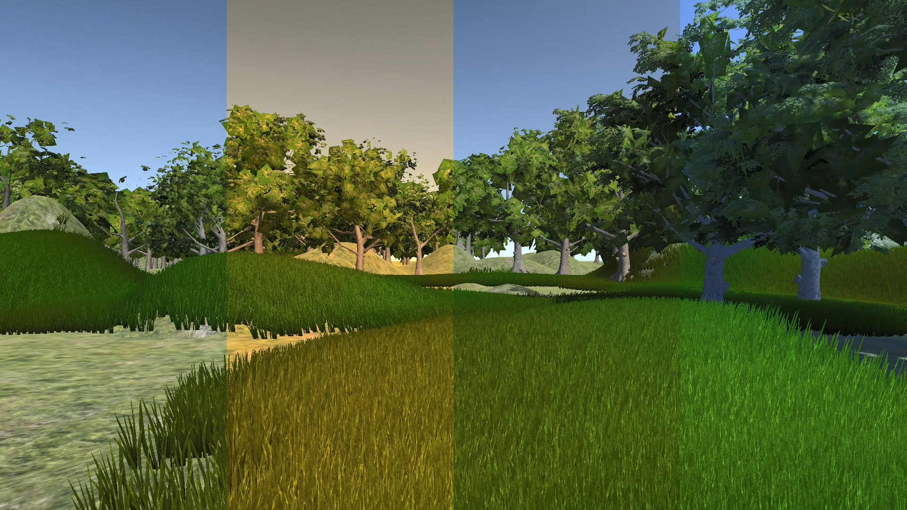

# Color Grading (3D LUT) for Unity
 - Real-time check for LUT file update
 - Shader-based 2D LUT & Script-based 3D LUT

[Unity Package](ColorCorrection.unitypackage)

[](https://vimeo.com/158728537)

# Usage
Add some on shader

```
#include "Assets/Packages/ColorCorrection/Shaders/LUT.cginc"
sampler2D _Lut;
```

Call ColorGrade() func

```
float4 c = tex2D(_MainTex, IN.uv);
c = ColorGrade(_Lut, c);
```

## Recommended LUT texture import settings
 - Advanced
 - No mipmap
 - Clamped
 - Bypass sRGB
 - Bilinear
 - Automatic Truecolor
